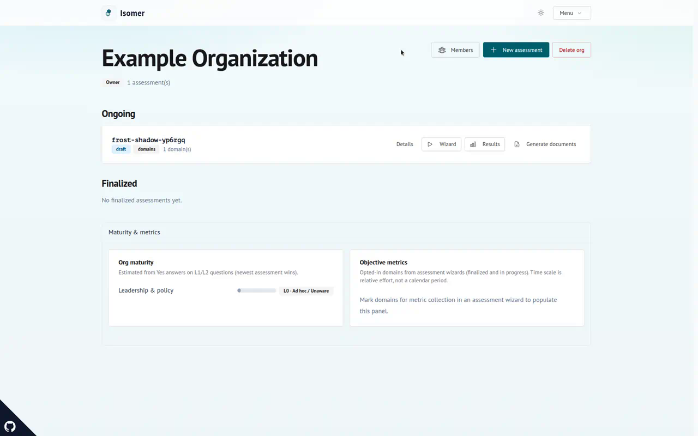

# isomer
 
**AI and information security governance content as code.** ISO/IEC 42001, ISO/IEC 27001 and the EU AI Act, expressed as schema-checked YAML and Markdown that you can diff, lint, and query.
 
[Live demo](https://isomer-demo.fly.dev) · [Roadmap](docs/roadmap.md) · [Contributing](AGENTS.md)
 

 
## Why this exists
 
Governance material usually ships as a PDF or a spreadsheet. It can't be diffed, it can't be tested, and it drifts out of date the moment a standard or a regulation moves.
 
isomer keeps the content in a repository instead. Requirements, cross-framework mappings, assessment questions and maturity rubrics are structured files with JSON Schemas behind them. A regulatory change becomes a pull request. The residual work between ISO 27001 and ISO 42001 becomes something you compute with `mix isomer.delta` rather than something you estimate.
 
Elixir tooling validates the corpus. SurrealDB stores it so applications can query it, including the assessment questionnaire in this repo.
 
## What's in the corpus
 
| Framework | Contents |
|---|---|
| Shared management system (`annex-sl-core/1.0`) | Clauses 4–10 used by both ISO 27001 and ISO 42001 |
| ISO/IEC 42001:2023 | AI management, Annex A controls |
| ISO/IEC 27001:2022 | Information security, Annex A controls |
| EU AI Act (`2024+2026-1744`) | Legal obligations, dates after the 2026 Omnibus update |
 
Two mapping files show what one framework leaves undone for another: ISO 27001 → ISO 42001, and EU AI Act → ISO 42001 / shared clauses.
 
Alongside the requirements themselves, the corpus carries **mappings** (framework-to-framework coverage and gaps), **questions** (48 assessment questions, weighted toward practical L1/L2 self-report), **rulesets** (guided classification, such as EU AI Act risk category), **rubrics** (L0–L4 maturity per domain), and **templates** (policy, Statement of Applicability, impact assessment, each declaring which requirements it evidences).
 
## Try the demo
 
The hosted demo is free and open to anyone who creates a login. The maintainer may clear the database without notice, so don't put real work in it.
 
## Run it locally
 
Requires **Elixir 1.20.3+** and **OTP 29+** (pinned in `mise.toml`).
 
```bash
mix deps.get
mix setup   # deps, assets, and git pre-commit hooks
mix lint    # schemas, cross-references, and charset
```
 
`mix setup` wires up `.githooks/` so commits run `mix format`, compile with warnings-as-errors, and `mix lint` before they land, matching CI. Re-run `mix git.hooks` if the hooks go missing, or run the gate manually with `mix precommit`.
 
<details>
<summary>
 <strong>Connecting to SurrealDB</strong>
</summary>
 
1. Copy `.env.example` → `.env` and fill in the Surreal and Vault values. Never commit `.env`. The Surreal password comes from **Vault**, not from a plain `SURREAL_PASSWORD`.
2. Smoke-test the connection with `mix isomer.db.ping`. If `.env` uses 1Password `op://` references, wrap it: `op run --env-file=.env -- mix isomer.db.ping`.
3. Publish the corpus with `mix isomer.db.sync` (add `--dry-run` to preview).
4. Optionally create the assessment and auth tables with `mix isomer.db.ensure_runtime`, then start the LiveViews with `mix phx.server`.
See [`docs/assessment-runtime.md`](docs/assessment-runtime.md) and [`docs/deploy.md`](docs/deploy.md).

</details>

<details>
<summary>
 <strong>All mix tasks</strong>
</summary>
 
| Command | What it does |
|---|---|
| `mix lint` | Full content check (schemas plus charset) |
| `mix isomer.validate` | Schema and cross-reference checks only |
| `mix isomer.charset` | Reject non-Latin letters in content files |
| `mix isomer.delta <mapping>` | Coverage buckets for a mapping: covered, partial, adjacent, net-new |
| `mix isomer.ruleset.eval` | Run a classification ruleset against a set of answers |
| `mix isomer.sbom --pretty` | Write a CycloneDX SBoM to `bom.cdx.json` (dev only, never `MIX_ENV=prod`) |
| `mix isomer.db.ping` | Check Vault and Surreal connectivity |
| `mix isomer.db.sync` | Load the corpus into Surreal, removing stale repo-managed rows |
| `mix isomer.db.sync_sbom` | Upsert the SBoM when dependencies changed |
| `mix isomer.db.ingest_sample` | Write one sample requirement as a sanity check |
| `mix isomer.db.ensure_runtime` | Create auth and org/assessment tables for the questionnaire |
 
EU AI Act classification, where the first matching outcome wins and YAML order matters:
 
```bash
mix isomer.ruleset.eval \
  --ruleset rulesets/eu-ai-act-classification.yaml \
  --answers '{"role":"provider","annex-iii-area":"employment"}'
```
 
On `main`, `sync-corpus.yml` runs `mix isomer.db.sync_sbom` after the corpus sync. The current bill of materials lives at Surreal record `sbom:isomer_tooling`, not as a GitHub Actions artifact.
 
</details>

<details>
<summary>
 <strong>Repository layout</strong>
</summary>
 
```text
frameworks/<name>/<version>/framework.yaml       framework manifest
frameworks/<name>/<version>/requirements/*.yaml  one file per requirement
mappings/*.yaml                                  links between frameworks
rulesets/*.yaml                                  classification questionnaires
rubrics/<domain>.yaml                            maturity levels L0–L4
questions/<domain>.yaml                          assessment questions
templates/tmpl-*.md                              document templates
vocab/domains.yaml                               domain list
schemas/*.schema.json                            JSON Schema definitions
lib/                                             Elixir tooling
docs/                                            design notes, screenshots, logo assets
```

</details>

## Contributing content
 
The rules that the linter can't catch:
 
- **No copied standard text.** Summaries are original paraphrases.
- **IDs match folders.** A requirement id looks like `framework/edition/ref`, for example `iso42001/2023/A.5.2`, and must sit in the matching directory. Framework `version` is the standard edition, not the Mix app version.
- **Every requirement lists evidence expectations**, meaning the artifact that would prove it.
- **Legal obligations need an `applicable_from` date.** Dates are data, never hard-coded. A ruleset outcome that sets `applicable_from` overrides the default for the obligations it activates.
- **Rulesets stop at the first match**, so put stronger screens such as prohibited uses ahead of weaker ones.
- **Partial or conflicting mappings need a short gap note.**
- **Shared clauses live in `annex-sl-core`.** ISO 27001 and ISO 42001 both inherit them; standard-specific extras stay on each requirement.
Full contributor notes are in [`AGENTS.md`](AGENTS.md).
 
## Scope and limits
 
isomer paraphrases; it does not reproduce. You still need your own licensed copies of the ISO standards. The legal paraphrases are tooling aids and not legal advice.
 
## Learn more
 
- Versioning, tooling vs content: [`docs/versioning.md`](docs/versioning.md)
- Assessment runtime and Surreal auth design: [`docs/assessment-runtime.md`](docs/assessment-runtime.md)
- Deploy to Fly.io or Railway: [`docs/deploy.md`](docs/deploy.md)

## License
 
This project is not currently under a license. Should you or your agents choose to misbehave and claim this work as your own, remember that Karma rides a slow pony.
 
---

## Built with

This project is built with and utilizes the following technologies:
 
<p align="center">
  <a href="https://elixir-lang.org" title="Built with Elixir" style="text-decoration: none;">
    <picture>
      <source media="(prefers-color-scheme: dark)" srcset="docs/assets/logos/elixir-light.svg" />
      
    </picture>
  </a>
</p>
<p align="center">
  <a href="https://surrealdb.com" title="Built with SurrealDB" style="text-decoration: none;">
    <picture>
      <source media="(prefers-color-scheme: dark)" srcset="docs/assets/logos/surrealdb-light.svg" />
      
    </picture>
  </a>
</p>
