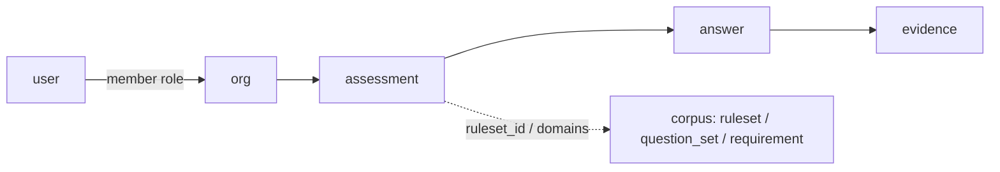

# Assessment runtime

Phoenix LiveView is the **projector**; SurrealDB is the **system of record** for
identity, tenancy, assessments, answers, and evidence. Corpus content continues
to be published by `mix isomer.db.sync` (`content_source = "repo"`).

Apply the runtime DDL with:

```
mix isomer.db.ensure_runtime
```

(`Isomer.Db.RuntimeSchema` — separate from corpus sync so prune/upsert never
touches tenant data.) CI also runs this after `mix isomer.db.sync` in
`.github/workflows/sync-corpus.yml`, so schema additions (e.g. `user.self_role` /
`experience_level` / `comfort_level`, tenant `artifact`) reach the demo DB on
merge to `main` without a manual Mix step. Ensure fails closed if `INFO FOR DB`
lacks `artifact` (or other tenant tables) or a **record-auth** signup cannot
write prefs / `SELECT` artifacts — root INFO alone has been a false green.

## Design

| Concern | Owner |
|---|---|
| Sign-up / sign-in / JWT session | Surreal `DEFINE ACCESS isomer_user` |
| Row-level authz | Surreal `PERMISSIONS` + `member` edges |
| Corpus publish | Elixir Mix (root/Vault) |
| UX / uploads / branching | Phoenix LiveView (`IsomerWeb`) |
| Surreal connection in UI | LiveView process holds the **user** token (not root) |

No Ash. No parallel user table in Ecto. No second auth product.

## Minimum schema



```
user ──member──▶ org
                │
                ▼
           assessment ──▶ answer ──▶ evidence
                │
                ├── ruleset_id?       (corpus ruleset id string)
                └── domains[]         (question_set keys)
```

| Table | Purpose |
|---|---|
| `user` | Record-auth subject (`$auth`). email + argon2 password. Optional guidance prefs: `self_role`, `experience_level`, `comfort_level` when the Surreal compute node has those columns; otherwise prefs also live in the Phoenix session. |

| `org` | Tenant (the organization being assessed). |
| `member` | `TYPE RELATION IN user OUT org` + `role`. |
| `assessment` | One questionnaire run for an org. |
| `answer` | Questionnaire answers **and** generated documents (`pack_ref = "__artifacts__"`; see Artifacts below). |
| `evidence` | File/note metadata attached to an answer (upload path; separate from generated docs). |
| `artifact` | **Schema only (forward readiness).** `RuntimeSchema` defines this table and root probes may `SELECT` it, but the app does **not** write here yet. |

Corpus tables (`question_set`, `ruleset`, `requirement`, `maps_to`, …) stay
owned by sync. Runtime ensure grants **select** to authenticated record users;
create/update/delete on corpus stay denied for them.

### `assessment` fields (logical)

| Field | Notes |
|---|---|
| `org` | `record org` |
| `title` | Display name |
| `status` | `draft` \| `in_progress` \| `complete` \| `archived` — UI treats `complete`/`archived` as **finalized** (editing locked; listed separately from ongoing on the org page) |
| `kind` | `ruleset` \| `domains` \| `combined` |
| `ruleset_id` | Corpus ruleset id string (e.g. `eu-ai-act/2024+2026-1744/classification`) |
| `domains` | `array<string>` of question-set domain ids |
| `domain_metrics` | Optional **flexible** object keyed by domain id: `{ collect, time_scale?, time_hours? }`. Opt-in only; drives the org **Objective metrics** panel (sparklines for Yes %, unanswered, evidence coverage %, time hours). **`time_scale`** is a relative effort rating for that domain on this assessment (`low` / `medium` / `high`) — not a calendar period or reporting window. **`time_hours`** is an optional clocked estimate that feeds the Time logged sparkline. Neither field affects maturity scores or answers. `FLEXIBLE` is required so SCHEMAFULL `assessment` accepts dynamic domain-id keys. |
| `classification` | Derived object from ruleset eval (nullable until complete/live) |
| `activates` | Derived list of requirement corpus ids |
| `created_by` | `record user` |
| `created_at` / `updated_at` | ISO datetimes |

### `answer` fields (logical)

| Field | Notes |
|---|---|
| `org` | Denormalized `record org` (keeps `PERMISSIONS` simple) |
| `assessment` | `record assessment` |
| `question_id` | Stable id inside the pack (`role`, `lp-01`, …) |
| `pack` | `ruleset` \| `question_set` |
| `pack_ref` | Ruleset id or domain id |
| `value` | bool / string / array (matches question `kind`) |
| `answered_by` | `record user` |
| `answered_at` | datetime |

Unique index: `(assessment, pack, pack_ref, question_id)`.

`evidence` also carries denormalized `org` for the same reason.

Authenticated users may `SELECT` other users' non-password fields so org
owners/admins can invite by email and label member lists. The `password` field
is `PERMISSIONS FOR select NONE`.

### Roles on `member`

`owner` \| `admin` \| `assessor` \| `viewer`

| Role | Assessment write | Answer write | Org admin |
|---|---|---|---|
| owner / admin | yes | yes | yes |
| assessor | create/update own runs | yes | no |
| viewer | read | no | no |

## LiveView map

Implemented under `lib/isomer_web`. Each authenticated LiveView opens a Surreal
session with the signed-in `user` JWT (never root/Vault).

Central chrome: header **Menu** dropdown (org context when on an assessment,
Organizations, Library, Settings, Sign out). No separate nav system.

| LiveView / controller | Route | Surreal touchpoints |
|---|---|---|
| `SessionController` | `/login`, `/session`, `/logout` | `signin` / `signup` via access `isomer_user`; JWT in cookie session |
| `OrgLive.Index` | `/orgs` | `SELECT` orgs via `member` where `in = $auth` |
| `OrgLive.New` | `/orgs/new` | `CREATE org` + `RELATE $auth->member->$org` (role `owner`) |
| `OrgLive.Show` | `/orgs/:org_id` | Assessments primary (rich rows); maturity/metrics **open by default** (still collapsible); Members button for owners/admins; role-aware actions |
| `OrgLive.Members` | `/orgs/:org_id/members` | Invite / role / remove for owners and admins; assessors and viewers are redirected to the org dashboard |
| `AssessmentLive.New` | `/orgs/:org_id/assessments/new` | Pick `kind` (`domains` / `ruleset` / `combined`), optional ruleset, `domains[]`; `CREATE assessment` |
| `AssessmentLive.Show` | `/assessments/:id` | Status, kind, classification summary, domains, finalize/reopen/delete; links to wizard + results + artifacts |
| `AssessmentLive.Wizard` | `/assessments/:id/q` | **Projector**: load `ruleset` + `question_set`; upsert `answer`; attach/list/remove `evidence` metadata; re-eval classification; adaptive help; domain metric opt-in |
| `AssessmentLive.Results` | `/assessments/:id/results` | Classification / `activates` + satisfier residual coverage + domain completion |
| `AssessmentLive.Artifacts` | `/assessments/:id/artifacts` | List corpus `template`; merge fields → `CREATE answer` (`pack_ref=__artifacts__`); download links |
| `LibraryLive` | `/library` | All templates + generated docs (answer-backed) visible to the user |
| `SettingsLive` / `SettingsController` | `/settings` | Session-backed guidance prefs + best-effort `UPDATE $auth` name/prefs |
| `ArtifactController` | `/artifacts/:id/download` | Fetch generated doc (`answer` id) with user JWT; Markdown or print-ready HTML (Save as PDF) |

### Planned (not yet routed)

Product sequencing: [`roadmap.md`](roadmap.md) (password recovery / SSO; content depth).

| LiveView | Route | Notes |
|---|---|---|
| Password recovery | `/password/…` | Token + email without Vault on the web path (slice H) |

### Evidence object storage

Surreal remains the metadata SoR (`evidence.label`, `content_type`, `storage_key`).
Binary bytes live in `Isomer.Evidence.Storage` backends:

| Backend | When |
|---|---|
| `memory` | Tests / ephemeral default |
| `local` | `EVIDENCE_BACKEND=local` + `EVIDENCE_LOCAL_ROOT` |
| `s3` | `EVIDENCE_BACKEND=s3` + `EVIDENCE_S3_*` (R2 / MinIO / AWS) |

Wizard: stage a file (shared upload), then **Attach evidence** on a saved answer;
URL/note metadata still works without a file. Download: `GET /evidence/:id/download`
(auth session required). Object GC on remove deletes the backend object when
`storage_key` is not an `http(s)` URL.

### Guidance prefs (adaptive copy)

Stored on `user`, edited in Settings. `Isomer.GuideCopy` adjusts wizard ledes,
per-question tips, and evidence hints from `self_role` / `experience_level` /
`comfort_level`. Same screens and controls for every level — only text density
changes. Prefs can be updated any time as comfort grows.

### Artifacts (template → document)

**Supported persistence:** generated documents are `answer` rows with
`pack = "question_set"` and `pack_ref = "__artifacts__"`. Document fields live
in `value` (`template_id`, `title`, `body`, `format`, `merge_values`).
`Isomer.Db.Tenant` create/list/get/delete APIs are the only write path used by
LiveView and downloads.

The standalone Surreal table `artifact` is still defined by
`mix isomer.db.ensure_runtime` so schema can converge across Surreal Cloud
compute nodes, but the application does not depend on it for Library or
downloads. That split exists because DEFINE can succeed in Actions while a Fly
dyno still reaches a node without the table.

1. Corpus `template` rows (from `templates/*.md` via sync) declare `merge_fields`.
2. Assessment Artifacts page collects values (org name prefilled) and runs
   `Isomer.Artifacts.Render`.
3. Result stored via `Tenant.create_artifact/2` as an `answer` row (shape above).
   Org/assessment delete removes these with other answers; optional best-effort
   cleanup may also `DELETE` leftover standalone-table rows.
4. Downloads: `.md` attachment; `format=pdf` serves print-ready HTML for browser
   Print → Save as PDF (no headless Chrome on the dyno).

### Wizard projector (the important LiveView)

`AssessmentLive.Wizard` is intentionally dumb about frameworks:

1. Read `assessment` → `ruleset_id` / `domains`
2. `SELECT` corpus `ruleset` / `question_set` (content)
3. Render controls from `kind` (`boolean` / `single` / `multi` / `evidence`)
4. On change: upsert `answer` in place (stable id for evidence links)
5. When ruleset answers change: run first-match eval (Elixir `Isomer.Ruleset.Evaluate`; later `fn::isomer::evaluate_ruleset`) and `UPDATE assessment SET classification=…, activates=…`
6. Evidence: `CREATE evidence` under the answer (`label`, `content_type`,
   `storage_key` as URL/note or object key); optional file upload to object
   storage; list + download + remove in-wizard

Evidence prompts on domain questions show the attach panel once an answer exists.

### Session wiring (LiveView ↔ Surreal)

```
Browser ──▶ Phoenix LiveView ──▶ SurrealDB (WSS)
                 │
                 └─ process holds user JWT from Surreal signin
                    (root/Vault credentials never enter LiveView)
```

Root connection remains Mix-only (`isomer.db.sync`, `isomer.db.ensure_runtime`).

## Out of scope for this minimum

- Presigned browser→S3 uploads, virus scanning, or cascade orphan GC on org delete
- Multi-system register / per-AI-system scoping (add `system` table later)
- Porting ruleset evaluation into SurQL functions
- Full Phoenix umbrella / UI chrome
- SSO / OIDC (`DEFINE ACCESS … WITH JWT` can land without changing tables)

## Apply order

1. `mix isomer.db.sync` — corpus content + corpus DDL/params/functions  
2. `mix isomer.db.ensure_runtime` — auth access + tenant tables + corpus read grants  
3. `mix phx.server` — LiveViews at `http://localhost:4000`  

Deploy notes: [`docs/deploy.md`](deploy.md).
