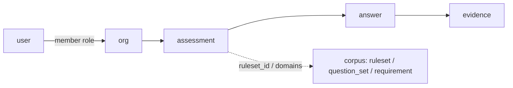

# Assessment runtime

Phoenix LiveView is the **projector**; SurrealDB is the **system of record** for
identity, tenancy, assessments, answers, and evidence. Corpus content continues
to be published by `mix isomer.db.sync` (`content_source = "repo"`).

Apply the runtime DDL with:

```
mix isomer.db.ensure_runtime
```

(`Isomer.Db.RuntimeSchema` — separate from corpus sync so prune/upsert never
touches tenant data.)

## Design

| Concern | Owner |
|---|---|
| Sign-up / sign-in / JWT session | Surreal `DEFINE ACCESS isomer_user` |
| Row-level authz | Surreal `PERMISSIONS` + `member` edges |
| Corpus publish | Elixir Mix (root/Vault) |
| UX / uploads / branching | Phoenix LiveView (`IsomerWeb`) |
| Surreal connection in UI | LiveView process holds the **user** token (not root) |

No Ash. No parallel user table in Ecto. No second auth product.

## Minimum schema



```
user ──member──▶ org
                │
                ▼
           assessment ──▶ answer ──▶ evidence
                │
                ├── ruleset_id?       (corpus ruleset id string)
                └── domains[]         (question_set keys)
```

| Table | Purpose |
|---|---|
| `user` | Record-auth subject (`$auth`). email + argon2 password. |
| `org` | Tenant (the organization being assessed). |
| `member` | `TYPE RELATION IN user OUT org` + `role`. |
| `assessment` | One questionnaire run for an org. |
| `answer` | One answer inside an assessment (audit row). |
| `evidence` | Artifact metadata attached to an answer. |

Corpus tables (`question_set`, `ruleset`, `requirement`, `maps_to`, …) stay
owned by sync. Runtime ensure grants **select** to authenticated record users;
create/update/delete on corpus stay denied for them.

### `assessment` fields (logical)

| Field | Notes |
|---|---|
| `org` | `record org` |
| `title` | Display name |
| `status` | `draft` \| `in_progress` \| `complete` \| `archived` — UI treats `complete`/`archived` as **finalized** (editing locked; listed separately from ongoing on the org page) |
| `kind` | `ruleset` \| `domains` \| `combined` |
| `ruleset_id` | Corpus ruleset id string (e.g. `eu-ai-act/2024+2026-1744/classification`) |
| `domains` | `array<string>` of question-set domain ids |
| `domain_metrics` | Optional object keyed by domain id: `{ collect, time_scale?, time_hours? }`. Opt-in only; drives the org **Objective metrics** panel (sparklines for Yes %, unanswered, evidence coverage %, time hours). |
| `classification` | Derived object from ruleset eval (nullable until complete/live) |
| `activates` | Derived list of requirement corpus ids |
| `created_by` | `record user` |
| `created_at` / `updated_at` | ISO datetimes |

### `answer` fields (logical)

| Field | Notes |
|---|---|
| `org` | Denormalized `record org` (keeps `PERMISSIONS` simple) |
| `assessment` | `record assessment` |
| `question_id` | Stable id inside the pack (`role`, `lp-01`, …) |
| `pack` | `ruleset` \| `question_set` |
| `pack_ref` | Ruleset id or domain id |
| `value` | bool / string / array (matches question `kind`) |
| `answered_by` | `record user` |
| `answered_at` | datetime |

Unique index: `(assessment, pack, pack_ref, question_id)`.

`evidence` also carries denormalized `org` for the same reason.

### Roles on `member`

`owner` \| `admin` \| `assessor` \| `viewer`

| Role | Assessment write | Answer write | Org admin |
|---|---|---|---|
| owner / admin | yes | yes | yes |
| assessor | create/update own runs | yes | no |
| viewer | read | no | no |

## LiveView map

Implemented under `lib/isomer_web`. Each authenticated LiveView opens a Surreal
session with the signed-in `user` JWT (never root/Vault).

| LiveView | Route | Surreal touchpoints |
|---|---|---|
| `SessionLive.New` | `/login` | `signin` / `signup` via access `isomer_user`; store JWT in session |
| `SessionLive.Delete` | `/logout` | Drop token; optional `invalidate` |
| `OrgLive.Index` | `/orgs` | `SELECT` orgs via `member` where `in = $auth` |
| `OrgLive.New` | `/orgs/new` | `CREATE org` + `RELATE $auth->member->$org` (role `owner`) |
| `OrgLive.Show` | `/orgs/:org_id` | Org header; maturity + objective-metrics panels; list assessments for org |
| `AssessmentLive.Index` | `/orgs/:org_id/assessments` | `SELECT assessment WHERE org = $org` |
| `AssessmentLive.New` | `/orgs/:org_id/assessments/new` | Pick `ruleset` and/or `domains[]` from corpus; `CREATE assessment` |
| `AssessmentLive.Show` | `/assessments/:id` | Shell: status, progress, nav to wizard/results |
| `AssessmentLive.Wizard` | `/assessments/:id/q` | **Projector**: load questions from `ruleset` / `question_set`; upsert `answer` rows; per-domain metric opt-in + time scale/hours; optional LIVE on answers |
| `AssessmentLive.Results` | `/assessments/:id/results` | Show `classification` / `activates`; for each id call `fn::isomer::satisfiers` + linked domain answers for residual view |
| `EvidenceLive.Upload` | modal / `/answers/:id/evidence` | Create `evidence` (+ object storage key later); link to `answer` |

### Wizard projector (the important LiveView)

`AssessmentLive.Wizard` is intentionally dumb about frameworks:

1. Read `assessment` → `ruleset_id` / `domains`
2. `SELECT` corpus `ruleset` / `question_set` (content)
3. Render controls from `kind` (`boolean` / `single` / `multi` / `evidence`)
4. On change: `UPSERT answer` with user token
5. When ruleset answers change: run first-match eval (Elixir port now; later `fn::isomer::evaluate_ruleset`) and `UPDATE assessment SET classification=…, activates=…`

Evidence prompts on domain questions open `EvidenceLive.Upload` without leaving the wizard.

### Session wiring (LiveView ↔ Surreal)

```
Browser ──▶ Phoenix LiveView ──▶ SurrealDB (WSS)
                 │
                 └─ process holds user JWT from Surreal signin
                    (root/Vault credentials never enter LiveView)
```

Root connection remains Mix-only (`isomer.db.sync`, `isomer.db.ensure_runtime`).

## Out of scope for this minimum

- Object storage implementation for evidence bytes (schema stores metadata only)
- Multi-system register / per-AI-system scoping (add `system` table later)
- Porting ruleset evaluation into SurQL functions
- Full Phoenix umbrella / UI chrome
- SSO / OIDC (`DEFINE ACCESS … WITH JWT` can land without changing tables)

## Apply order

1. `mix isomer.db.sync` — corpus content + corpus DDL/params/functions  
2. `mix isomer.db.ensure_runtime` — auth access + tenant tables + corpus read grants  
3. `mix phx.server` — LiveViews at `http://localhost:4000`  

Deploy notes: [`docs/deploy.md`](deploy.md).
